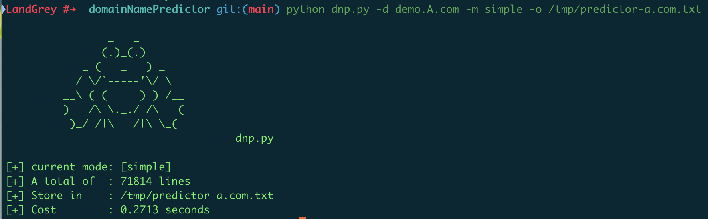

# dnp — domain name predictor
[](https://www.python.org/)


> 一个简单的现代化公司域名使用规律预测及生成工具
>
> A simple modernized enterprise domain name predictor and generator


## Snapshot




## Q&A

- 什么叫 "**现代化**" 公司？

  我个人主观判断上的不成熟定义，就是公司整体 IT 基础设施和架构设计完善，会使用微服务、协同开发、自动化测试、自动化打包发布、自动化部署、自动化日志收集和自动化运维监控等多项 "现代化" 的技术解决高并发等较大体量业务问题的公司；

  这些公司或组织团体一般有较多业务，以互联网领域、近些年新成立的公司居多，域名命名及分配使用比较规范。

  

- 什么是**域名预测**？

  简答来讲就是基于 "现代化" 公司比较规范的域名使用规律已经使用的新技术架构，在已知某个域名后，预测该域名可能有哪些变体形式的域名。

  举一个简单的例子：

  已知 A 公司有一个域名 `shoot.A.com`，那么对应的接口服务域名可能是  `api.shoot.A.com`、 `shoot.restful-api.A.com`、 `shoot-api.A.com` 等；

  测试、预发等不同环境的域名可能是 

   `shoot-api.test.A.com` 、 `test.api.shoot.A.com` 、 `pre.shoot-api.A.com` 等；

  对应的不同环境的管理监控域名可能是  `shoot-monitor.dev.A.com` 、`shoot-dev-monitor.A.com` 、`st1.shoot-dashboard.A.com`  等；

  对应不同负载代理的域名可能是  `shoot-api.corp.A.com` 、 `api.shoot.internal.A.com` 等；

  对应的后端 api 服务生产环境的域名可能是 `backend-api.prod.shoot.A.com`、   `backend-api-prod.shoot.A.com`等。

  当然，在缺少域名前缀，仅知道域名为 `A.com` 时，也可以按照此规律直接进行预测。

  

- 为什么要写这个工具？

  随着对许多 "现代化" 业务的接触和实际渗透测试，我发现在域名的探测这个很小的领域中，现有的子域名爆破、第三方服务接口查询都不能很好的覆盖到 **域名预测** 这个概念。

  这样当你得到 `shoot.A.com` 域名后，很可能会遗漏上面举例中的相关重要域名，导致 "**灯下黑**"。


- 这个工具可以干什么？

  按照配置文件和生成规则来完成上述的**域名预测**，生成完整的域名字典。

  目前一个域名在  `simple`  规则下大概生成 **6w—7w** 左右个域名，在  `default`  规则下生成 **26w—29w** 个域名。

  生成完域名后可以用支持完整域名验证的工具去验证域名是否存在，比如使用 [ksubdomain](https://github.com/knownsec/ksubdomain) 命令 `subdomain -f predictor-domains.txt -verify` 。


## Download

```
git clone https://www.github.com/landgrey/domainNamePredictor.git
cd domainNamePredictor/
pip install -r requirements.txt
chmod +x dnp.py
python dnp.py
```


## Usage

```
python dnp.py -d A.com
python dnp.py -f A.com-domains.txt -m simple
python dnp.py -d demo.A.com -m simple -o /tmp/predictor-a.com.txt
```

